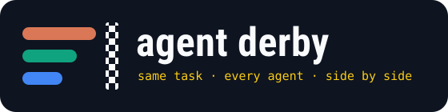
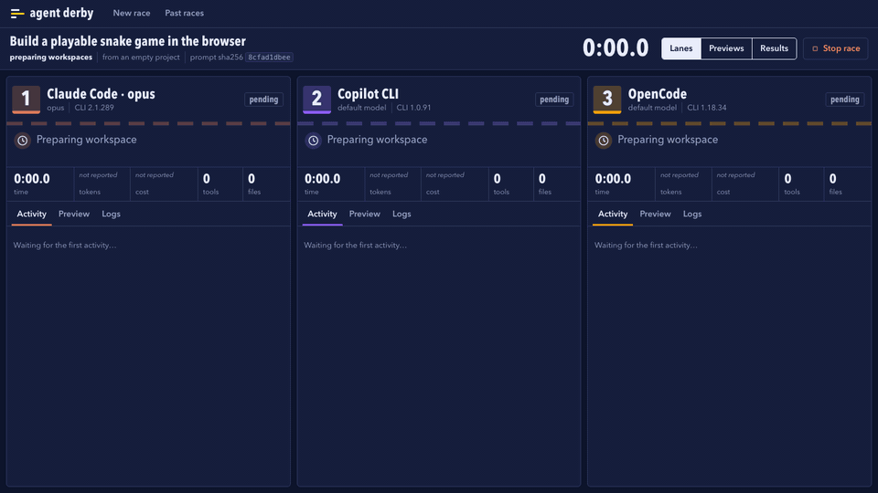
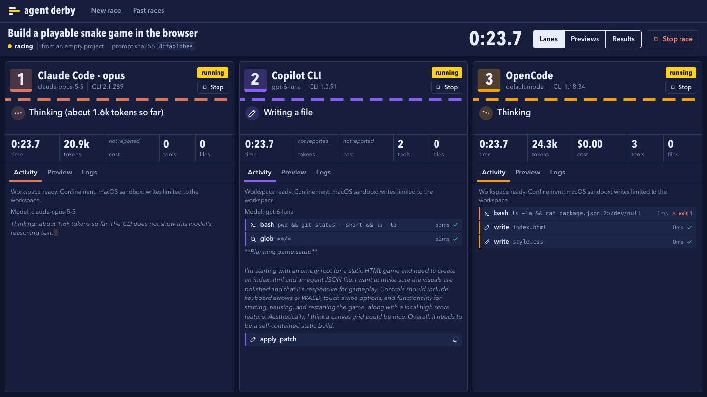
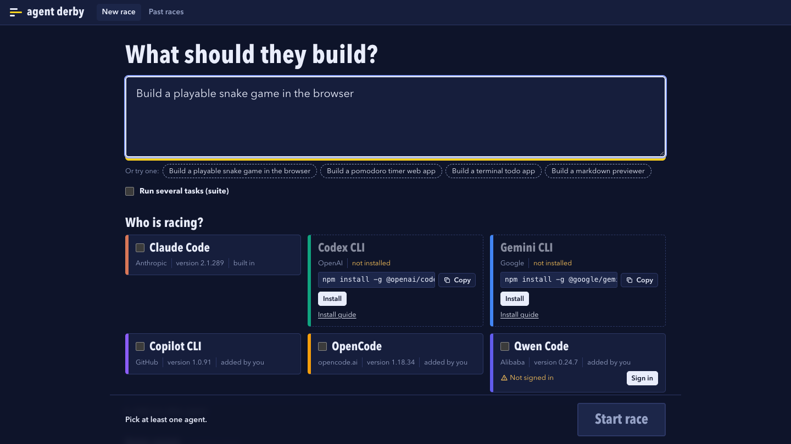
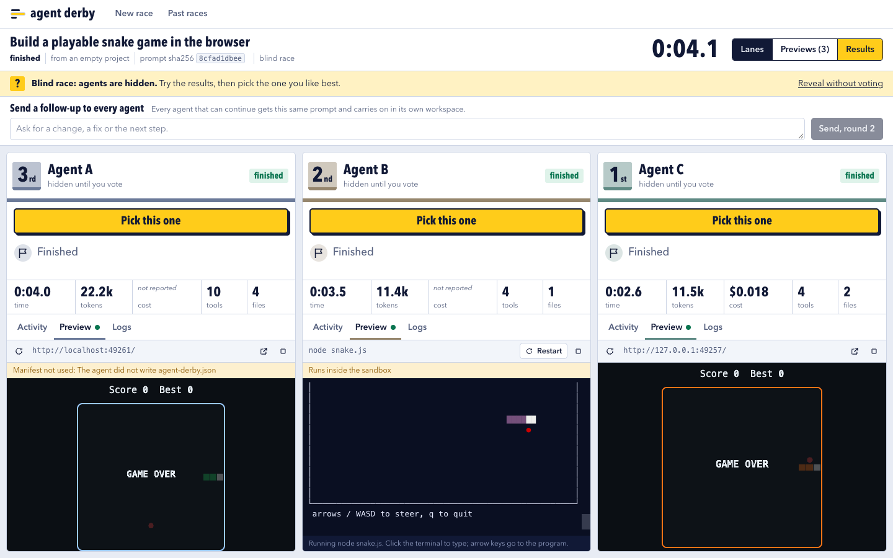
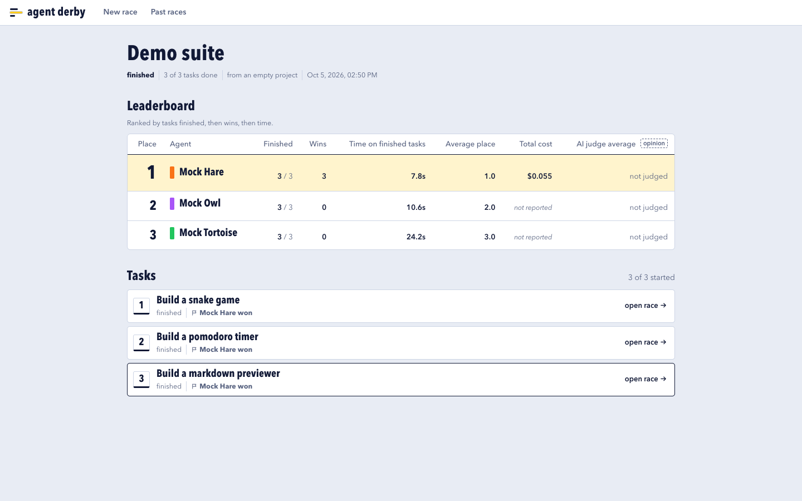
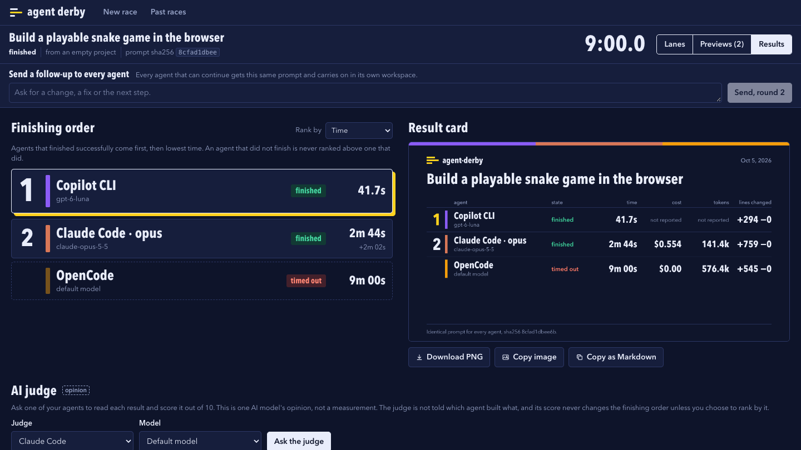

<p align="center">
  
</p>

<p align="center">
  <b>Give the same coding task to several AI coding agents at once, watch them work side by side, then try what each one built.</b>
</p>

<p align="center">
  <a href="https://github.com/osmanahmadxai/agent-derby/actions/workflows/ci.yml"></a>
  <a href="LICENSE"></a>
  
  
</p>

<p align="center">
  
</p>

```bash
npx https://github.com/osmanahmadxai/agent-derby/releases/latest/download/agent-derby.tgz
```

That starts a local server and opens the app in your browser. No account, no cloud, no API keys: the agent CLIs you are already signed in to do the work.

---

## Why

People argue about which coding agent is best, but the evidence is public benchmarks on other people's code. Agent Derby lets you race agents on **your** task and judge the outcome, not just the numbers.

- **Claude Code, Codex CLI, Gemini CLI, Copilot CLI, OpenCode, Qwen Code**, or any other agent CLI you describe in a small config.
- **Same family, different models**: race Claude Opus against Claude Sonnet, or one agent against itself at different thinking-effort levels.
- **Every agent gets the identical prompt**, byte for byte, and starts at the same moment.
- **Each agent works in its own sandboxed workspace.** Your working tree and branches are never touched.
- **When an agent finishes, its result runs inside the app**: web apps and games in an iframe, terminal programs in a real terminal.

<p align="center">
  <br>
  <sub>Mid-race, from a real race with the same prompt for all three: Claude Code on Opus 5.5, GitHub Copilot CLI, and OpenCode on one of its free models. The GIF above is the same race, sped up.</sub>
</p>

## What you need

- **Node.js 20+** and **git**.
- At least one agent CLI. Missing ones are shown greyed out with an **Install** button that puts the official CLI into Agent Derby's own folder, and a **Sign in** button that runs the CLI's own login. A subscription is enough.
- Nothing at all to try it out: the built-in **demo agents** replay a scripted run and spend no tokens.

## Three ways to use it

### In the browser

```bash
agent-derby
```

Type a task, tick the agents, pick models, press **Start race**.

<p align="center">
  
</p>

### In the terminal

The screen splits into one pane per agent, with the same live activity and counters. (Captured from the same real race, attached with `agent-derby watch`.)

```bash
agent-derby run "build a playable snake game in the browser" --agents claude:opus,copilot,opencode
agent-derby run            # no arguments: asks for the task, agents and models
```

```text
 AGENT DERBY  Build a playable snake game in the browser                                                 28.0s
1 Claude Code · opus         RUNNING│2 Claude Code · sonnet      FINISHED│3 Claude Code · haiku        RUNNING
claude-opus-5-5 · v2.1.289          │claude-sonnet-5-5 · v2.1.289        │claude-haiku-4-5-20251001 · v2.1.289
Thinking                            │Finished                            │Thinking
28.0s  tok 42k  n/r                 │17.3s  tok 46k  $0.0604             │28.0s  tok 85k  ~$0.0476 est.
tools 1  files 0                    │tools 2  files 1  +101 -0           │tools 2  files 1
────────────────────────────────────│▶ http://127.0.0.1:62084/           │────────────────────────────────────
# Workspace ready. Confinement:     │────────────────────────────────────│I'll build a playable snake game in
# macOS sandbox: writes limited to  │# macOS sandbox: writes limited to  │the browser with HTML, CSS, and
# the workspace.                    │# the workspace.                    │JavaScript.
# Model: claude-opus-5-5            │# Model: claude-sonnet-5-5          │✓ edit index.html 0.0s
✓ command ls -la 0.1s               │✓ edit index.html 0.0s              │Now I'll create the agent-derby.json
                                    │✓ edit agent-derby.json 0.0s        │file:
                                    │…                                   │✓ edit agent-derby.json 0.0s
                                    │I also created `agent-derby.json`,  │…
                                    │which marks it as a static site with│## Features:
                                    │`"root": "."` and no install or     │- **Classic Snake gameplay** with
                                    │start command. Nothing is left      │smooth movement and collision
                                    │running.                            │detection
                                    │# Finished                          │- **Arrow keys or WASD** controls (
 n/r = not reported by the CLI · est. = estimated from the price table
 r results · o open in browser · s stop race · 1-9 stop lane · q quit
```

| Command | What it does |
| --- | --- |
| `agent-derby` | Start the app and open the browser |
| `agent-derby run [task]` | Race in the terminal. `-a claude:opus@high,copilot,opencode` picks agents, models and effort, `--blind` hides who is who, `-r <repo>` starts from a git repo, `-f "npm test"` sets a finish command, `-t 10m` and `-c 2` set time and cost limits, `--plain` prints lines instead of panes, `--json` prints the final result |
| `agent-derby agents` | List agents, versions and sign-in state |
| `agent-derby install <agent>` / `login <agent>` | Install an agent's official CLI, run its sign-in |
| `agent-derby suite tasks.txt -a claude,copilot` | Run every task in a file (one per line) and print a leaderboard |
| `agent-derby followup <race> "add a pause key"` | Send every agent in a finished race the same follow-up |
| `agent-derby judge <race> --with claude:haiku` | Ask an AI judge for its opinion of each result |
| `agent-derby replay <race> -o race.html` | Save the race as one shareable web page |
| `agent-derby history` / `show <race>` | Past races |
| `agent-derby watch <race>` | Attach the terminal view to a race running in the app |
| `agent-derby keep <race> <lane> --branch <name>` | Keep one agent's work (or `--folder <path>`) |
| `agent-derby delete <race>` | Delete a race, its workspaces and its branches |

Press `o` in the terminal view to open the same live race in the browser, and `agent-derby watch` to go the other way.

### As a desktop app

Installers for macOS, Windows and Linux are attached to each [release](https://github.com/osmanahmadxai/agent-derby/releases). The desktop app is the same UI in its own window, and it brings its own Node runtime, so Node.js does not need to be installed. The builds are not code-signed: on macOS right-click the app and choose Open the first time; on Windows choose "More info" then "Run anyway".

## More than one race

**Blind race.** Tick "Blind race" and the app hides which agent is in which lane: they become Agent A, B and C, in neutral colours, in a shuffled order. Try the results, pick the one you like best, and only then see who built it.

<p align="center">
  <br>
  <sub>A blind race with the demo agents.</sub>
</p>

**Follow-up rounds.** When a race ends, send every agent the same follow-up ("add a pause key", "now make it work on mobile"). Each one continues its own session in its own workspace, and its clock and counters keep adding up.

**AI judge.** Ask any signed-in agent to review every result against the task. The judge sees the task and the changes, never which agent made them, and returns a score out of 10 with strengths and problems. A verdict is one model's opinion: it is labelled that way everywhere and never changes the ranking.

**Suites.** One task is an anecdote. Give the app a list of tasks and it runs them one after another with the same agents, then shows a combined leaderboard: tasks finished, wins, time, cost.

<p align="center">
  <br>
  <sub>A suite of three tasks with the demo agents.</sub>
</p>

**Replay.** Any race can be saved as a single self-contained web page that replays it, to send to someone or post. Nothing is uploaded.

**Thinking effort.** Agents that have an effort setting get a picker next to the model picker.

## What gets measured

<p align="center">
  
</p>

| | |
| --- | --- |
| **Time** | wall time, time to first edit, time waiting on the model versus running commands |
| **Limits** | optional time and cost limits per agent, and a stall limit: an agent that prints nothing at all for 5 minutes (adjustable) is stopped and marked as stalled |
| **Tokens** | input, output, cache read and write, reasoning |
| **Cost** | the figure the CLI reports; otherwise an estimate from [`config/pricing.json`](config/pricing.json), always labelled **est.** |
| **Activity** | turns, tool calls by type, commands run and failed, errors and retries |
| **Code** | files created, modified, deleted, lines added and removed, new dependencies |
| **Outcome** | finish command pass or fail, test counts, whether it builds, whether the preview started |
| **Reproducibility** | model, CLI version, the exact command line, the prompt's SHA-256 |

**If a CLI does not report something, the app says "not reported".** It never shows a guess as a measurement. Token counts are normalised so "input" always means uncached input, whichever vendor's convention the CLI uses.

The results screen has a podium (successful finishes first, then time; re-sortable by cost, tokens or lines changed), a comparison table with the best value in each row marked, a diff viewer per agent, a result card you can export as an image, and **Keep this one**, which copies the chosen agent's work to a branch or folder you name. Nothing is ever merged for you.

## Isolation and the sandbox

- Starting from a repo, each agent gets a **git worktree** on its own branch `agent-derby/<race>/<lane>`, created from your current commit. Uncommitted changes are not included. Starting empty, each gets a fresh folder with `git init`.
- Agents run with file edits and commands pre-approved, so they are confined by the operating system instead. Your MCP servers and personal Claude Code skills are not loaded into a race: they differ per machine and would skew the comparison.

| Platform | Confinement |
| --- | --- |
| macOS | Seatbelt (`sandbox-exec`): the whole machine is readable, the network works, but writes are limited to the agent's workspace, temp folders, package-manager caches and the agent CLI's own state folder |
| Linux | The same rules with [bubblewrap](https://github.com/containers/bubblewrap), when `bwrap` is installed |
| Windows | **No OS sandbox.** Agents are separated by workspace only, and the app says so in every lane |
| Codex CLI | Uses its own `workspace-write` sandbox on every platform |

The finish command and the code the agents wrote (install, build, start) run under the same confinement. Workspaces stay on disk under `~/.agent-derby/races` until you delete the race.

## Instant preview

Every prompt ends with a short fixed instruction asking the agent to write `agent-derby.json`, saying how to run the result (`web`, `static`, `terminal` or `other`, plus install and start commands, honouring `PORT`). When an agent finishes, the app installs dependencies, picks a free port, starts the result, waits for it to answer, and embeds it in that lane.

If the manifest is missing or wrong, the project type is detected from its files. If that fails too, you get the logs and a box to type a command, and "preview failed" is recorded as a metric. Previews are stopped and their ports freed when you leave the race, when nobody has had the race open for two minutes, and when the app exits. A process registry cleans up after a crash on the next start.

## Adding agents

**No code:** use "Add any other agent" on the setup screen, or edit `~/.agent-derby/agents.json`:

```json
[
  {
    "id": "my-agent",
    "name": "My Agent",
    "command": "my-agent",
    "args": ["run", "--model", "{model}", "--yes", "{prompt}"],
    "promptVia": "arg",
    "format": "text"
  }
]
```

`format` can be `text`, or `claude-stream-json`, `codex-json` or `gemini-stream-json` if the CLI speaks one of those formats, which gives it full metrics.

**With code:** an adapter is one file with five jobs: detect, start, parse events, stop, read usage. See [docs/WRITING_AN_ADAPTER.md](docs/WRITING_AN_ADAPTER.md).

## Docker

```bash
docker run --rm -it -p 4747-4769:4747-4769 -v agent-derby:/data ghcr.io/osmanahmadxai/agent-derby
```

Open <http://localhost:4747>. The container is the sandbox, and it cannot see sign-ins on your host: install and sign in to the agent CLIs inside it with the buttons in the app. For your existing sign-ins, run natively.

## From source

```bash
git clone https://github.com/osmanahmadxai/agent-derby.git
cd agent-derby
npm install
npm run build
npm start          # or: node dist/cli.js run "..." --agents mock-hare,mock-tortoise,mock-owl
npm test
```

`npm run desktop` opens the desktop shell, `npm run dist` builds installers for the current platform.

## Configuration

| File | Purpose |
| --- | --- |
| [`config/pricing.json`](config/pricing.json) | Prices used only to estimate cost when a CLI reports none. Override in `~/.agent-derby/pricing.json` |
| [`config/models.json`](config/models.json) | Model suggestions for the picker. Any model name can be typed. Override in `~/.agent-derby/models.json` |
| `~/.agent-derby/agents.json` | Your custom agents |
| `AGENT_DERBY_HOME` | Move the data folder |
| `AGENT_DERBY_NO_SANDBOX=1` | Turn the OS sandbox off |
| `AGENT_DERBY_CLAUDE_BIN`, `_CODEX_BIN`, `_GEMINI_BIN`, `_COPILOT_BIN`, `_OPENCODE_BIN`, `_QWEN_BIN` | Point at a specific executable |

## Supported agents

| Agent | Status | Notes |
| --- | --- | --- |
| Claude Code | **Verified** with real races | Reports tokens and cost. Effort levels, follow-ups |
| Copilot CLI | **Verified** with real races | Reports "premium requests", not tokens or dollars, so those show as not reported. Effort levels, follow-ups |
| OpenCode | **Verified** with real races | Its free models need no sign-in. Does not name the model in its output. Follow-ups |
| Codex CLI | Written, not yet run signed in | Flags from `--help`, events from the published SDK types |
| Gemini CLI | Written, not yet run signed in | Flags from `--help`, events from the CLI's own source |
| Qwen Code | Written, not yet run signed in | Speaks the same stream format as Claude Code |
| Anything else | Through `agents.json` | Full metrics if it speaks a known format, otherwise shown as text |

"Verified" means it has been raced for real on this project's test task, inside the sandbox, and its parser is tested against a recording of its actual output. "Written, not yet run signed in" means the parser is tested against recorded failure output and hand-written samples only. If you use one of those, a bug report with the output is the most useful thing you can send.

## Honest limits

- **Three of the six built-in agents have never completed a signed-in run here** (see the table above).
- **Windows** is built and unit-tested in CI but has no sandbox and has not been exercised end to end.
- **A blind race is a courtesy, not a secret.** The app hides names, models and colours, but an agent's own messages or tool names can still give it away, and the data is all there in the export.
- **An AI judge is an opinion.** Different judges disagree, and a model may favour work that resembles its own.
- The shipped price table is nearly empty on purpose: add the models you care about, and estimates appear. Claude Code reports its own cost.
- On a subscription, "cost" is the API-equivalent figure the CLI reports, not what you were billed.
- The demo agents ignore the task and always build a snake game.

## License

[MIT](LICENSE)
